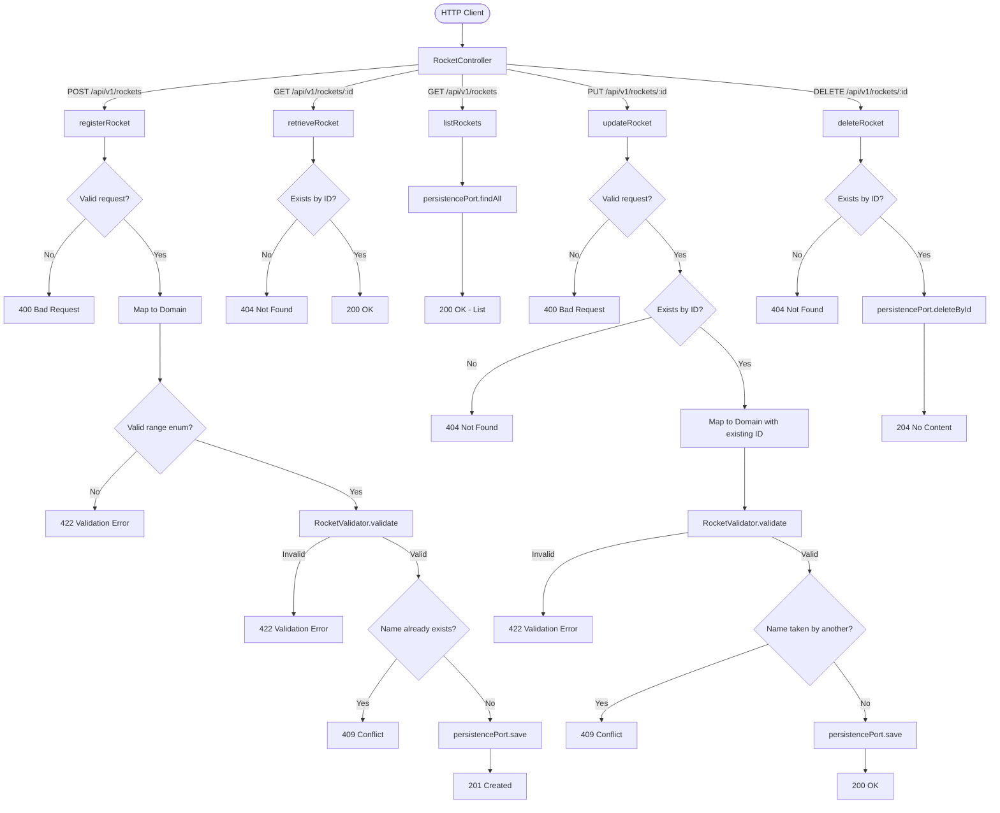
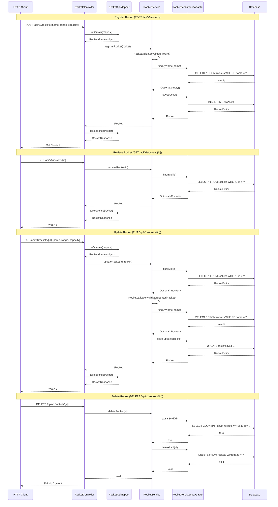
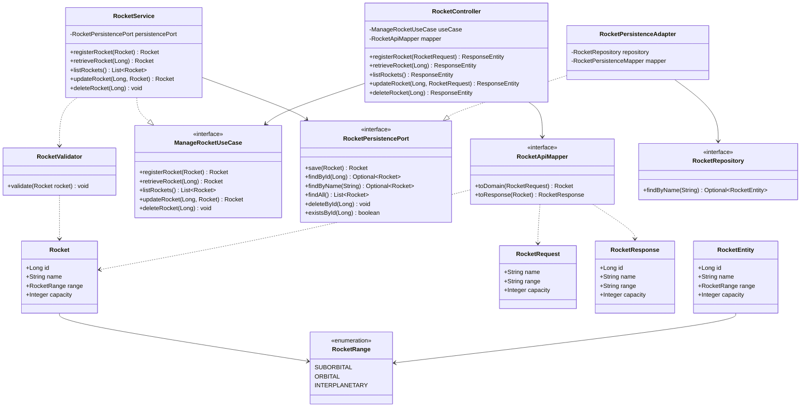
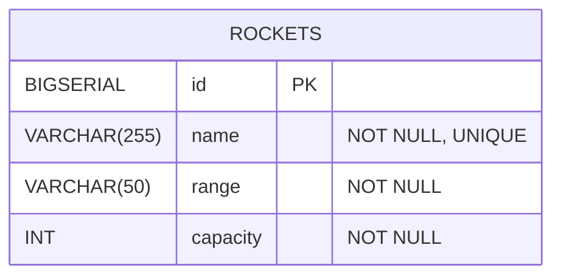

# Rocket Feature

## Description

- **As a** manager, **I can** register, update, and delete rockets in the fleet, **so that** I can schedule flights for bookings.
- **As a** user, **I can** retrieve details of a specific rocket or list all available rockets, **so that** I can match customer requirements to the correct rocket capabilities.
- **As an** admin, **I can** enforce validation rules on rocket range and capacity, **so that** unsafe configurations and overbooking are prevented.

## Logic Flowchart

Each operation follows a validate → check existence → persist pattern. Write operations (register/update) enforce domain rules before touching the database, while read/delete operations resolve existence first.

## Sequence Diagram

Shows the full request lifecycle for each operation, from HTTP client through the web adapter, application service, and persistence adapter down to the database.

## Class Diagram

Shows the hexagonal architecture structure: domain model and validator at the core, application layer with use case port and service, and infrastructure adapters on the outside.

## Entity Relationship Diagram

The `rockets` table is the sole entity. It stores each rocket's unique name, range classification, and passenger capacity.

